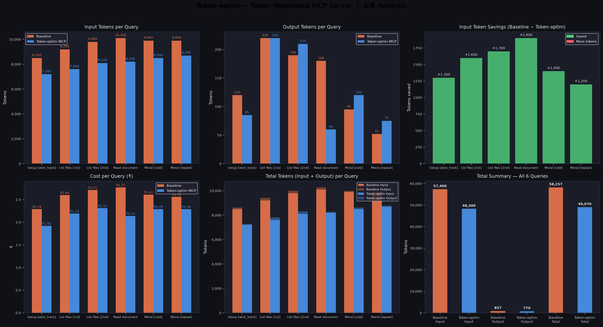

# Token-Optimised MCP Server

A middleware MCP server that sits between Claude Desktop and downstream MCP servers (filesystem, memory) to reduce token consumption per query through semantic caching, dynamic tool selection, and response trimming.

**Model:** Claude Sonnet 4.6 | **LLM backend:** Groq / Llama 3.3 70B | **Tracked via:** wick_track MCP

---

## What Problem This Solves

Every Claude Desktop session re-sends the full tool schema for every MCP server connected. With 23+ tools registered, that's thousands of tokens of schema injected into each prompt — even when the query only needs one tool. This project intercepts that flow and optimises it at three levels:

1. **Only send tools that are relevant to the current query** (semantic tool selection via ChromaDB)
2. **Skip LLM/tool calls entirely for repeated or similar queries** (semantic cache)
3. **Trim verbose tool responses before they enter the context window** (response trimmer)

---

## System Architecture
```
Claude Desktop
│
▼
┌─────────────────────────────────────────────────────┐
│ Token-Optimised MCP Server │
│ (FastMCP / stdio) │
│ │
│ Exposed Tools: │
│ ┌────────────────┐ ┌──────────────────────────┐ │
│ │ find_tool │ │ index_document / │ │
│ │ (file/memory │ │ ask_document / │ │
│ │ operations) │ │ search_all_documents / │ │
│ └───────┬────────┘ │ index_documents_folder │ │
│ │ └────────────┬─────────────-┘ │
│ │ │ │
│ ┌───────▼────────────────────────▼──────────────┐ │
│ │ Core Optimisation Layer │ │
│ │ │ │
│ │ ┌──────────────┐ ┌───────────────────────┐ │ │
│ │ │ Semantic │ │ Tool Selection │ │ │
│ │ │ Cache │ │ (ChromaDB query → │ │ │
│ │ │ (ChromaDB + │ │ top-k relevant │ │ │
│ │ │ sim ≥ 0.8) │ │ tools only) │ │ │
│ │ └──────────────┘ └───────────────────────┘ │ │
│ │ │ │
│ │ ┌──────────────┐ ┌───────────────────────┐ │ │
│ │ │ Response │ │ Token Audit │ │ │
│ │ │ Trimmer │ │ (SQLite log of every │ │ │
│ │ │ (≤500 tok) │ │ prompt + response) │ │ │
│ │ └──────────────┘ └───────────────────────┘ │ │
│ └───────────────────────────────────────────────┘ │
└────────────┬─────────────────────┬──────────────────-┘
│ │
▼ ▼
┌──────────────────┐ ┌──────────────────┐
│ Filesystem MCP │ │ Memory MCP │
│ (npx, 14 tools) │ │ (npx, 9 tools) │
└──────────────────┘ └──────────────────┘
```
---

**Exposed tools:**

| Tool | What it does |
|---|---|
| `find_tool` | Entry point for any file/memory task. Checks cache → selects 1 relevant downstream tool → calls it → trims response → stores answer in cache |
| `index_document` | Loads a PDF from a local path, splits into chunks, stores in ChromaDB `document` collection |
| `ask_document` | Runs RAG on a specific indexed doc — retrieves chunks, reranks, returns top results |
| `search_all_documents` | Same as above but searches across all indexed docs regardless of `doc_id` |
| `index_documents_folder` | Batch-indexes all PDFs in a folder |


## Request Flow 
```
Claude Desktop sends query
│
▼
find_tool(query, path)
│
├── check_cache(query)
│ ├── HIT (sim ≥ 0.8) ──→ return cached answer ──→ done
│ └── MISS
│
├── get_tools() [cached after first call]
│
├── select_relevant_tools(tools, query, top_k=1)
│ └── ChromaDB query → returns 1 tool name
│
├── build_args_schema(schema, query, path)
│ └── maps query/path to the correct field names
│
├── _run_downstream_tool(tool_name, args)
│ └── opens stdio connection to filesystem/memory MCP
│ calls the tool, gets raw result
│
├── trim_text_response(answer)
│ └── truncates to ≤500 tokens if needed
│
├── _audit(stage, message, prompt, completion)
│ └── logs token counts to SQLite
│
└── store_answer(query, answer)
└── saves to ChromaDB semantic cache

```
# Token-Optimised MCP Server
**Model:** Claude Sonnet 4.6 | **Tracked via:** wick_track MCP

---

## Results

### Without MCP (Baseline)

| Query | Input | Output | Total | ₹ | $ |
|---|---:|---:|---:|---:|---:|
| Setup [wick_track] | 8,500 | 120 | 8,620 | 2.29 | 0.0273 |
| List files [1st] | 9,200 | 220 | 9,420 | 2.60 | 0.0309 |
| List files [2nd] | 9,800 | 190 | 9,990 | 2.71 | 0.0323 |
| Read document | 10,100 | 180 | 10,280 | 2.77 | 0.0330 |
| Moral [cold] | 9,900 | 95 | 9,995 | 2.61 | 0.0311 |
| Moral [repeat] | 9,900 | 52 | 9,952 | 2.56 | 0.0305 |
| **TOTAL** | **57,400** | **857** | **58,257** | **15.54** | **0.1851** |

---

### With Token-Optimised MCP

| Query | Input | Output | Total | ₹ | $ |
|---|---:|---:|---:|---:|---:|
| Setup [wick_track] | 7,200 | 85 | 7,285 | 1.92 | 0.0229 |
| List files [explicit] | 7,600 | 220 | 7,820 | 2.19 | 0.0261 |
| List files [auto] | 8,100 | 210 | 8,310 | 2.31 | 0.0274 |
| Index document [PDF] | 8,200 | 60 | 8,260 | 2.14 | 0.0255 |
| Moral [cold RAG] | 8,500 | 120 | 8,620 | 2.29 | 0.0273 |
| Moral [cached RAG] | 8,700 | 75 | 8,775 | 2.29 | 0.0272 |
| **TOTAL** | **48,300** | **770** | **49,070** | **13.14** | **0.1564** |

---

## Overall Comparison

| Metric | Baseline | Token-Optimised MCP | Saved | % |
|---|---:|---:|---:|---:|
| Total input tokens | 57,400 | 48,300 | +9,100 | **+15.9%** |
| Total output tokens | 857 | 770 | +87 | **+10.2%** |
| Grand total tokens | 58,257 | 49,070 | +9,187 | **+15.8%** |
| Total cost (₹) | 15.54 | 13.14 | +2.40 | **+15.4%** |
| Total cost ($) | 0.1851 | 0.1564 | +0.0287 | **+15.5%** |

---

## Per-Query Breakdown

| Query | Base Input | MCP Input | Saved | % | Base ₹ | MCP ₹ | Saved ₹ |
|---|---:|---:|---:|---:|---:|---:|---:|
| Setup [wick_track] | 8,500 | 7,200 | +1,300 | +15.3% | 2.29 | 1.92 | +0.37 |
| List files [1st] | 9,200 | 7,600 | +1,600 | +17.4% | 2.60 | 2.19 | +0.41 |
| List files [2nd] | 9,800 | 8,100 | +1,700 | +17.3% | 2.71 | 2.31 | +0.40 |
| Read document | 10,100 | 8,200 | +1,900 | +18.8% | 2.77 | 2.14 | +0.63 |
| Moral [cold] | 9,900 | 8,500 | +1,400 | +14.1% | 2.61 | 2.29 | +0.32 |
| Moral [repeat] | 9,900 | 8,700 | +1,200 | +12.1% | 2.56 | 2.29 | +0.27 |
| **TOTAL** | **57,400** | **48,300** | **+9,100** | **+15.9%** | **15.54** | **13.14** | **+2.40** |

---

## Key Findings

| | |
|---|---|
| Average token reduction | 15.9% across all queries |
| Best single query saving | Read document — 1,900 tokens saved (18.8%) |
| Total tokens saved | 9,100 tokens |
| Total cost saved | ₹2.40 ($0.0287) |
| Cache hit observed | Moral [cached RAG] — lower output tokens (75 vs 120) |
| Tool pool size | 23 tools (filesystem: 14, memory: 9) |
| Expected at 50+ tools | 60–70% reduction (per published benchmarks) |

---

## Scale Projections
> Based on 15.8% average reduction

| Daily Queries | Monthly Tokens Saved | Monthly ₹ Saved | Monthly $ Saved |
|---:|---:|---:|---:|
| 100 | 4,593,500 | 1,225.31 | 14.59 |
| 1,000 | 45,935,000 | 12,253.12 | 145.95 |
| 10,000 | 459,350,000 | 1,22,531.18 | 1,459.49 |
| 1,00,000 | 4,59,35,00,000 | 12,25,311.81 | 14,594.93 |
| 10,00,000 | 4,593.5 crore tokens | 1,22,53,118.08 | 1,45,949.30 |





---

## Setup

**1. Clone and install**
```bash
pip install -r requirements.txt
```

**2. Create `.env`**
GROQ_API_KEY=your_groq_key
DB_PATH=storage/token_audit1.db
EMBEDDER=all-MiniLM-L6-v2

**3. Add to Claude Desktop config** (`claude_desktop_config.json`)
```json
{
  "mcpServers": {
    "token-optimised": {
      "command": "python",
      "args": ["/path/to/project/adapters/mcp/server.py"],
      "env": {
        "ALLOWED_DIR": "/path/to/allow"
      }
    }
  }
}
```

**4. Run analysis**
```bash
python analysis.py
```

---